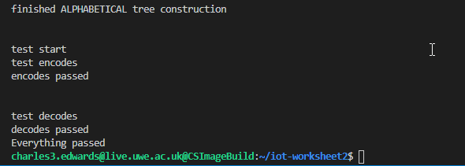

# UWE Assignment Year 2 | Internet Of Things | Worksheet 2 Part 1
This github repo contains the resources for worksheet 2 part 1 for internet of things

## Contents
1. [Task 1](#Task-1)
2. [Task 2](#Task-2)
3. [Task 3](#Task-3)
4. [Task 4](#Task-4)

## Task 1
In this task we had to learn or get familiar with morse code. Using our SSH clients we connected to a web server hosted on our SSH server csctcloud.uwe.ac.uk with the URL “localhost:10105”. We used this website to encode ASCII text into morse code and decode morse into ASCII. We had to put in a message ‘us’ or our own.

<br>
##### *Figure 1*
<br>

## Task 2
In this task we are going to create a python file called “**morse.py**” this script was to contain 2 functions that can be invoked with another python script. These 2 functions will be responsible for encoding and decoding a given message string. There are many ways that we could approach this task to solve the encoding/decoding of morse code. However, due to morse codes nature of being binary we were tasked with using a binary tree. This task actually requires 2 binary trees.

<br>
##### *Figure 2*
<br>

Within the "morse.py" you can invoke 2 functions, here is an example:

```py
result = encode('test')
output: - . ... -

result = decode('-.. --- --. . -.-. --- .. -. / - --- / - .... . / -- --- --- -.')
output: dogecoin to the moon
```

The encode function uses an alphabetically sorted binary tree using the order number of the character given. This can be accessed in the “**morse.py**” as “root_AlphabeticalCodeTree”

The decode function uses the binary tree shown in figure 2. Its root is defined as “root_MorseCodeTree”

## Task 3
In this task we now must test our code, we had to create another script called “**main.py**” this python script was responsible for testing our binary trees we created in the previous task. We used the following code below:
```py
assert morse.encode('us') == '..- ...', "Should be ..- ... "
assert morse.encode('=') == '-...-', "Should be -...-"
```
We tested our code using the keyword assert, assertions are a form of sanity check that can be used to verify data or conditions of code. If there is a problem, it will raise an exception and we can then use the debugger to find out what when wrong.

If you run my “**main.py**” I have conducted 10 tests. 5 encoding, 5 decoding. Here is a screen shot of those tests being run and all tests passed. 

<br>
##### *Figure 3*
<br>

## Task 4

In this task we need to expand what the binary tree can encode and decode. Right now, it was not able to convert certain special symbols such as punctation. So, in this task we were given additional symbols to add to the binary tree.

<br>
##### *Figure 4*
<br>

In figure 4 is a diagram of the binary tree and how it would look like if we were to add these new nodes in. Obviously, we need to define some empty nodes to so that our binary tree would be correct. I have also developed the "**main.py**" to include testing for these chars here is an example of test encode misc. chars below I have also done the same for decode:

```py
# test misc chars
def test_encode_misc_chars():
    assert morse.encode('.') == '.-.-.-', "Should be .-.-.-"
    assert morse.encode('(') == '-.--.', "Should be -.--."
    assert morse.encode(')') == '-.--.-', "Should be -.--.-"
    assert morse.encode('+') == '.-.-.', "Should be .-.-."
    assert morse.encode('?') == '..--.', "Should be ..--."
    assert morse.encode(',') == '--..--', "Should be --..--"
    assert morse.encode('-') == '-....-', "Should be -....-"
    assert morse.encode('"') == '.-..-.', "Should be .-..-."
    assert morse.encode(';') == '-.-.-.', "Should be -.-.-."
    assert morse.encode(':') == '---...', "Should be ---..."
    assert morse.encode('&') == '.-...', "Should be .-..."
    assert morse.encode('$') == '...-..-', "Should be ...-..-"
    assert morse.encode('!') == '-.-.--', "Should be -.-.--"
    assert morse.encode("'") == '.----.', "Should be .----."
    assert morse.encode('_') == '..--.-', "Should be ..--.-"
    assert morse.encode('¿') == '..-.- ', "Should be ..-.-"
```

**To run my code solution for worksheet 2 part 1, make sure you are using Python 3.8 and above and make sure "main.py" and "morse.py" are in the same folder.**
